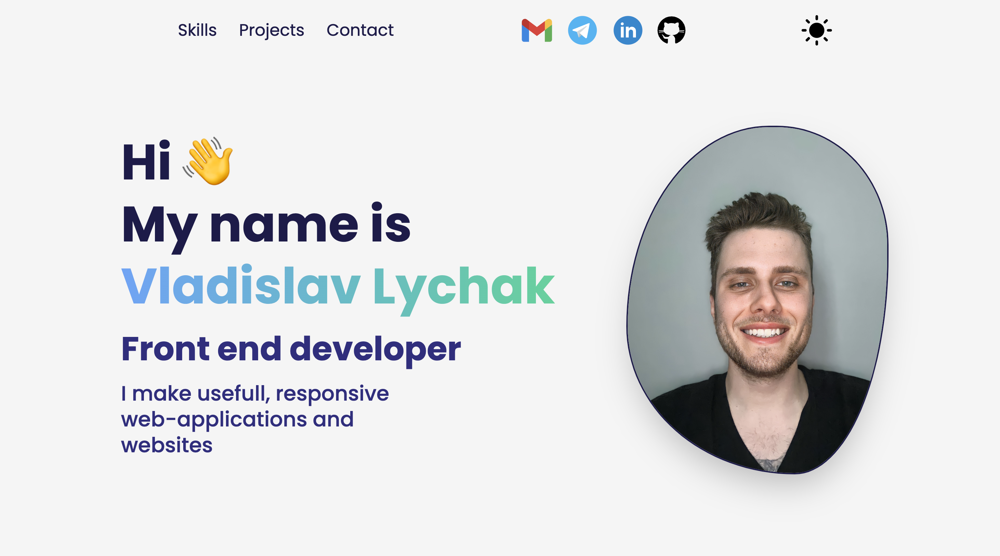

 

  <a href="https://vladislav-lychak.netlify.app/" target='_blank'>
    

<h3 align="center">Portfolio website</h3>

  

    My portfolio website built with React JS and Tailwind
     
    <a href="https://github.com/LychakVlad/portfolio-react-website"><strong>Explore the code »</strong></a>
     
     
    <a href="https://vladislav-lychak.netlify.app/">View Demo</a>
  

<!-- ABOUT THE PROJECT -->

## About The Project

The Portfolio React Website is a web application that provides an overview my skills and experiences. This project is developed using technologies such as React, Tailwind and EmailJS. The application is responsive, which means it can be accessed from any device.The contact page includes a form that allows visitors to send messages to the developer.

### Built With

- REACT JS
- TAILWIND
- EmailJS

## Contact

Vladislav Lychak - [@LinkedIn](https://www.linkedin.com/in/vladislav-lychak/) - lycakvladislav@gmail.com

Project Link: [https://vladislav-lychak.netlify.app/](https://vladislav-lychak.netlify.app/)

(<a href="#readme-top">back to top</a>)

<!-- MARKDOWN LINKS & IMAGES -->
<!-- https://www.markdownguide.org/basic-syntax/#reference-style-links -->

[React.js]: https://img.shields.io/badge/React-20232A?style=for-the-badge&logo=react&logoColor=61DAFB
[React-url]: https://reactjs.org/
